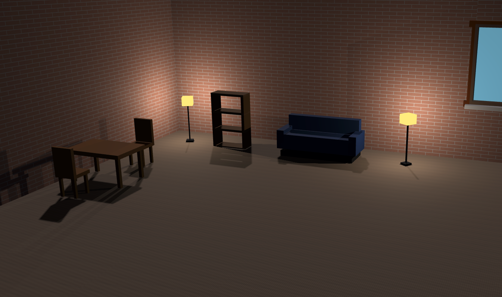

# 3D Room Designer

## Autor
**Mateusz Adamczyk**



## Opis projektu

Aplikacja pozwala na interaktywne projektowanie pomieszczeń w przestrzeni 3D. Użytkownik może dodawać meble (stoły, krzesła, regały, sofy, lampy), przesuwać je, obracać i skalować. Całość renderowana jest w czasie rzeczywistym z realistycznym oświetleniem i cieniami.

## Demo

Aplikacja jest dostępna online: [https://room-designer-3d.vercel.app](https://room-designer-3d.vercel.app)


Można też zbudować ją jako standalone desktop app (instrukcja poniżej).

## Funkcjonalności

### Podstawowe
- Pełne środowisko 3D z podłogą i ścianami
- 5 typów mebli: stół, krzesło, regał, sofa, lampa
- Wybieranie obiektów kliknięciem myszki
- Przesuwanie, obracanie i skalowanie mebli
- Kamera orbitalna (przeciąganie myszką + scroll do zoom)
- Sterowanie kamerą WASD

### Grafika 3D
- Model oświetlenia Phonga (ambient + diffuse + specular)
- Shadow mapping z PCF soft shadows
- Tekstury proceduralne (drewniana podłoga, ceglane ściany)
- Możliwość ładowania własnych tekstur
- Ray casting do precyzyjnego wybierania obiektów
- Point lights z lamp (dynamiczne oświetlenie)

### Interface
- GUI do zarządzania sceną (dodawanie/usuwanie mebli)
- Sliders do kontroli pozycji, rotacji i skali
- Panel do zmiany tekstur
- Kontrola parametrów oświetlenia

## Stack technologiczny

- **Frontend**: TypeScript, Vue 3, Vite
- **Grafika**: Three.js (WebGL)
- **UI**: lil-gui
- **Desktop** (opcjonalnie): Tauri

## Instalacja i uruchomienie

### Wymagania
- Node.js v18 lub wyższy
- npm

### Kroki instalacji

1. Sklonuj repozytorium
```bash
git clone https://github.com/matadamczyk/room-designer-3d.git
cd room-designer-3d/app
```

2. Zainstaluj zależności
```bash
npm install
```

3. Uruchom w trybie deweloperskim
```bash
npm run dev
```

Aplikacja będzie dostępna pod adresem `http://localhost:1420`

### Budowanie aplikacji desktopowej (opcjonalnie)

Jeśli chcesz zbudować standalone desktop app:

1. Zainstaluj Rust (https://rustup.rs/)

2. Uruchom aplikację jako desktop app
```bash
npm run tauri dev
```

3. Zbuduj wersję produkcyjną
```bash
npm run tauri build
```

Gotowa aplikacja będzie w katalogu `src-tauri/target/release/`.

## Sterowanie

### Tryby kontroli (przełączanie klawiszem T)

**Camera Mode (domyślny)**
- Lewy przycisk myszy + przeciąganie: obrót kamery
- Scroll: przybliżanie/oddalanie
- WASD: ruch kamery w płaszczyźnie poziomej
- Q/E: ruch w górę/w dół
- Kliknięcie na obiekt: zaznaczenie

**Transform Mode**
- Kliknięcie i przeciąganie: przesuwanie zaznaczonego mebla
- Meble automatycznie trzymają się podłogi
- Obiekty są ograniczone do granic pokoju

### Edycja obiektów
- Kliknięcie na obiekt zaznacza go (żółte podświetlenie)
- Panel GUI po prawej stronie pozwala na dokładną edycję pozycji, rotacji i skali
- Przycisk "Delete" usuwa zaznaczony mebel

### Panel GUI
- **Controls**: przełączanie trybów Camera/Transform
- **Scene**: dodawanie nowych mebli
- **Textures**: zmiana tekstur (proceduralne lub z URL)
- **Lighting**: kontrola kierunku i intensywności światła, włączanie/wyłączanie cieni
- **Selected Object**: edycja parametrów zaznaczonego obiektu

### Nakładanie tekstur
1. Zaznacz obiekt (kliknij na podłogę, ścianę lub mebel)
2. W panelu "Textures" wybierz teksturę z menu dropdown
3. Kliknij "Apply Selected Texture"

Dostępne są tekstury proceduralne (drewno, cegła, metal, itp.) oraz możliwość wczytania własnej tekstury z URL.

## Meble

Dostępne typy mebli:
- Stół
- Krzesło
- Regał
- Sofa
- Lampa

Wszystkie meble są generowane proceduralnie z prostych brył geometrycznych.

### Shadery GLSL
Three.js wykorzystuje shadery GLSL do renderowania całej sceny:
- **Vertex shader** - transformacje wierzchołków, obliczenia pozycji w przestrzeni ekranu
- **Fragment shader** - obliczenia oświetlenia Phonga (ambient + diffuse + specular), shadow mapping, teksturowanie

Wbudowane materiały Three.js (`MeshStandardMaterial`, `MeshPhongMaterial`) kompilują się do shaderów GLSL, które wykonują się na GPU.

### Shadow Mapping
Cienie są generowane przy użyciu wbudowanego systemu Three.js:
- Rozdzielczość shadow map: 2048x2048
- PCF (Percentage Closer Filtering) dla miękkich krawędzi
- DirectionalLight rzuca cienie na całą scenę
- Point lights z lamp również rzucają cienie

### Oświetlenie
Model Phonga z trzema składowymi:
- Ambient light - podstawowe oświetlenie otoczenia
- Diffuse - rozpraszanie światła na powierzchni
- Specular - odblaski

Dodatkowo każda lampa ma point light który dynamicznie oświetla scenę.

### Tekstury
- Tekstury proceduralne generowane w runtime (drewno, cegła, metal)
- Three.js TextureLoader z CORS support
- UV mapping z repeat wrapping dla seamless tiling
- Możliwość przypisania tekstury do dowolnego obiektu

## Wykorzystane biblioteki

- [Three.js](https://threejs.org/) - biblioteka do grafiki 3D w WebGL
- [lil-gui](https://lil-gui.georgealways.com/) - GUI library
- [Vue 3](https://vuejs.org/) - framework JavaScript
- [Vite](https://vitejs.dev/) - build tool
- [Tauri](https://tauri.app/) - framework do aplikacji desktopowych - opcjonalnie

## Assety i tekstury

- Opcjonalnie można wczytać tekstury z zewnętrznych źródeł:
  - [Poly Haven](https://polyhaven.com/textures)
  - [ambientCG](https://ambientcg.com/)

## Licencja

MIT License

